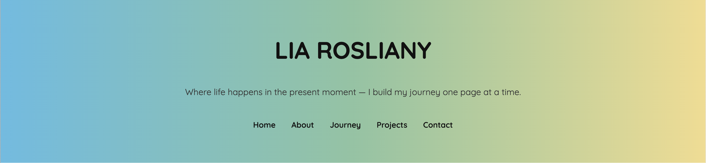
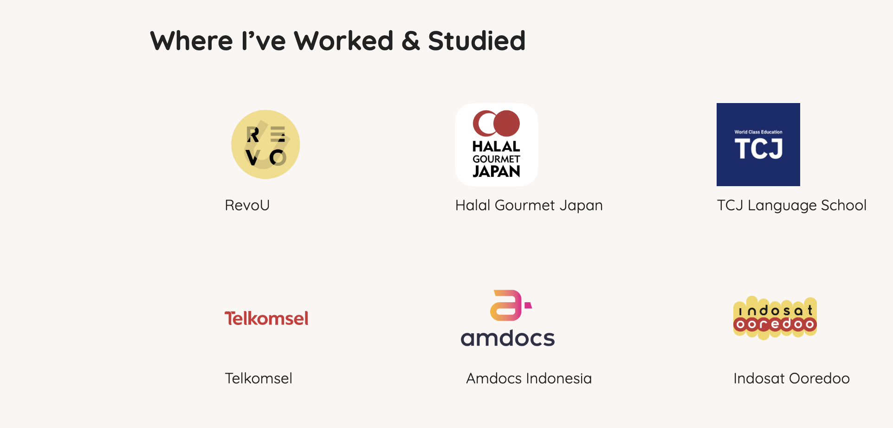
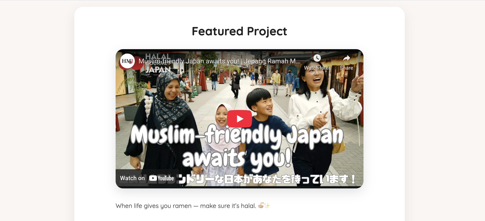
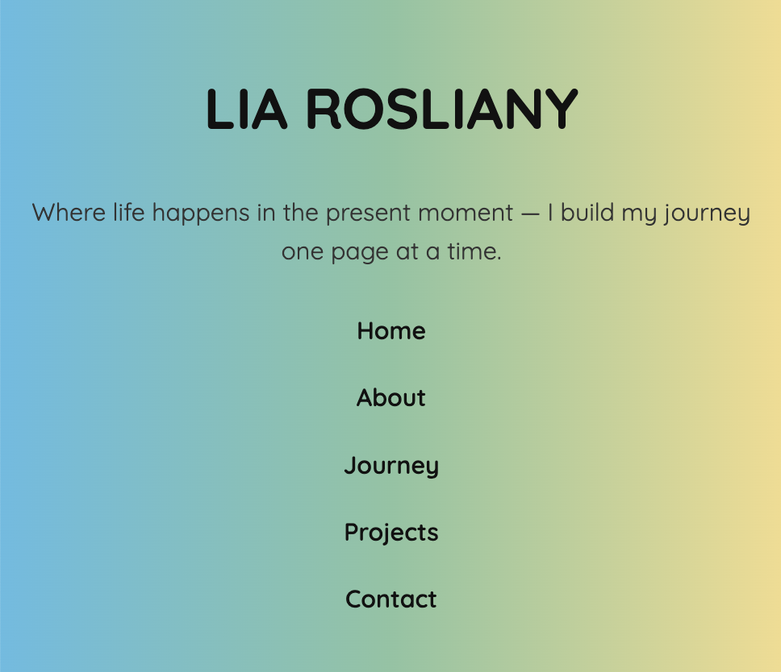

# 🌐 Personal Website — Lia Rosliany

Milestone 1 & Module 2 – RevoU FSSE Oct 2025

This project is a personal website built as part of the Milestone assignments for RevoU Full Stack Software Engineering program.  
Module 1 focused on HTML structure, while Module 2 enhances the UI/UX using CSS (vanilla CSS, no framework).

Live Website: **https://revou-fsse-oct25.github.io/milestone-1-liaro25/**  
Repository: **https://github.com/revou-FSSE-Oct25/milestone-1-liaro25/**

---

## 📌 **Overview**

This personal website represents my resume, professional journey, projects, and contact information.  
The website aims to:

- Present my experience and profile in a clean and structured way
- Display information in visually appealing sections
- Apply responsive design and accessibility best practices
- Serve as a base for future updates to my personal portfolio and a growing website with more projects that may be uploaded as a showcase

---

## ✨ **Features Implemented (Module 2 CSS)**

### 🖊️ Design Process

The layout for the Home, About, and Projects pages was first designed in Figma before being implemented in code. This helped ensure a clear visual structure and consistent styling across the website.

### 🎨 **CSS Styling Improvements**

- Hero section with gradient background
- Responsive layout using Flexbox & Grid
- Updated typography hierarchy (H1–H3, paragraph styling)
- Color palette using CSS variables for consistency
- Styled navigation bar & footer
- Hover animations for links and buttons
- Clean UI with better spacing and section separation
- Icons and images styled with proper sizing & responsiveness

### 📱 **Responsive Design**

- Layout adjusts across mobile, tablet, and desktop
- Media queries applied at multiple breakpoints
- Images scale properly using `max-width`, `height: auto`, and responsive containers
- Text alignment and spacing shift dynamically based on screen size

### ♿ **Accessibility Enhancements**

- Added `aria-label` to navigation and footer social icons
- All images include descriptive `alt` text
- Buttons and input fields include focus states
- Improved semantic HTML structure

### 📝 **Contact Page Styling**

- Styled input fields and textareas
- Responsive form layout
- Button design consistent with site theme
- Improved accessibility and usability

### 📌 **Additional Improvements**

- Favicon added
- Organized file structure (`/assets`, `/css`)
- README updated with all features for Module 2

---

## 🗂️ **Pages Included**

- **Home** — Hero, introduction, and highlight sections
- **About Me** — Biography & background with flex/grid layout
- **Journey** — Work history, achievements, and timeline
- **Projects** — Project cards with hover effects
- **Contact** — Form with styled fields and responsive layout

---

## 🛠️ **Tech Stack**

| Category            | Details                                     |
| ------------------- | ------------------------------------------- |
| **Languages**       | HTML5, CSS3                                 |
| **Styling Tools**   | Flexbox, Grid, CSS Variables, Media Queries |
| **Hosting**         | GitHub Pages                                |
| **Version Control** | Git & GitHub                                |
| **Design Tool**     | Figma                                       |
| **AI**              | ChatGPT                                     |
| **Font**            | Google Font                                 |
| **Dev Tools**       | Visual Studio Code (Prettier, LiveServer)   |

---

## 📸 Screenshots

Below are several screenshots showcasing the CSS implementation across the website, including gradient backgrounds, Flexbox, Grid layouts, card designs, and responsive behavior.

---

### 🎨 **Hero Section (CSS Gradient Background)**

The hero uses a custom CSS gradient. Gradients can be explored and generated here:  
🔗 https://cssgradient.io/

<p>
  
</p>

---

### 🧩 **Flexbox Layout (Homepage – Glimpse Section)**

The homepage uses Flexbox to structure the icon + text glimpse cards in a responsive horizontal layout.

<p>
  
</p>

---

### 🧱 **CSS Grid Layout (Journey – Companies Section)**

The companies section uses CSS Grid, adapting from 4 columns → 2 columns → 1 column depending on screen size.

<p>
  
</p>
---

### 📺 **Card Component (Featured Project)**

The Projects page uses a card-style container with shadow, padding, and a fully responsive embedded YouTube video.

<p>
  
</p>

---

### 📱 **Responsive Mobile View**

The website is optimized for mobile using multiple targeted media queries for hero, navigation, grids, tables, and overall spacing.

<p>
  
</p>

---

## 📁 **Project Structure** revised 26/11/25

```
milestone-1-liaro25
    ├── about.html
    ├── assets
    │   ├── documents
    │   │   └── CV Lia Rosliany 2.pdf
    │   ├── icons
    │   │   ├── about.png
    │   │   ├── contact.png
    │   │   ├── favicon-32x32.png
    │   │   ├── github.png
    │   │   ├── instagram.png
    │   │   ├── journey.png
    │   │   ├── linkedin.png
    │   │   └── projects.png
    │   ├── images
    │   │   ├── fuji_bg.jpg
    │   │   └── pasFoto.png
    │   └── logos
    │       ├── amdocs.png
    │       ├── hgj.png
    │       ├── huawei.png
    │       ├── indosat.png
    │       ├── nokia.png
    │       ├── pccw.png
    │       ├── revou.png
    │       ├── tcj.png
    │       ├── telkomsel.png
    │       ├── telu.png
    │       ├── xl.jpeg
    │       └── yl.png
    ├── contactme.html
    ├── index.html
    ├── journey.html
    ├── projects.html
    ├── README.md
    ├── screenshot
    │   ├── about.png
    │   ├── hero.png
    │   ├── journey.png
    │   ├── mobile.png
    │   └── project.png
    └── style.css
```

---

## 📌 **Feedback Implementation** add 26/11/2025

- Add backup fonts and use **@font-face** with locally hosted font files to ensure stability if external font links fail.
- Add `srcset` and `sizes` attributes for responsive image optimization across different screen sizes.
- Add a transition animation for the quote under the Hero Title to enhance visual engagement.
- Add a background image to the body using `background-size: cover`.
- Use `background-size: contain` for glimpse icons to maintain proper proportions.
- Implement lazy loading on images except background image to improve overall page performance and loading speed.

---

## 📌 **Future Enhancements**

- Integrate TailwindCSS for faster and more scalable styling.
- Add JavaScript interactions such as a mobile-friendly hamburger menu and “See More / See Less” toggles for the About Me and Projects sections.
- Implement smooth animations to enhance overall user experience.
- Expand the Projects section with more work samples.
- Add a Dark Mode option for better accessibility and user preference.

---

## 🙌 Credits

Created by Lia Rosliany as part of **RevoU Full Stack Software Engineering Program (Oct 2025)**.
